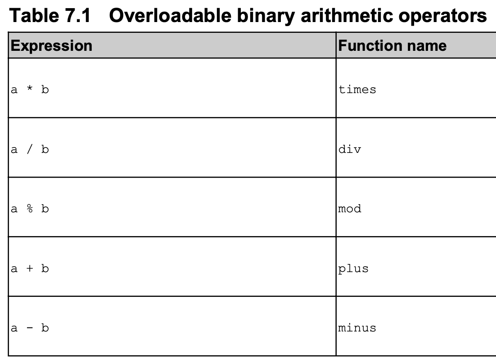
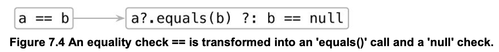

# Operator overloading
and other conventions

---
# Java - Interface specific language features

---
# `Iterable`
#### [foreach](https://www.baeldung.com/java-loops#foreach) in Java 5+
```java
// language support for Iterable
List<String> stringList = Arrays.asList("One", "Two", "Three", "Drink");
assert stringList instanceof Iterable;
for (String s : stringList) {
    System.out.println(s);
}
```
---
# `AutoCloseable`
#### [try-with-resources](https://docs.oracle.com/javase/tutorial/essential/exceptions/tryResourceClose.html) in Java 7+
```java
// java 7 syntax for AutoClosable (try-with-resources)
try (FileInputStream fis = new FileInputStream(".")) {
    assert fis instanceof AutoCloseable;
} catch (IOException ioe) {
    ioe.printStackTrace();
}
```

---
# Kotlin - Conventions
extension by set of predefined method **name**s

---


---
# `+` (infix) operator
```kotlin
class Point(val x:Int, val y:Int) {
    operator fun plus(other: Point) = Point(x+other.x, y+other.y)
}

val p1 = Point(1,1)
val p2 = Point(2,3)

// >>> (p1+p2).x
// kotlin.Int = 3
```
`operator` modifier를 빼면?

---
```
>>> p1+p2
error: 'operator' modifier is required on 'plus' in 'Line_2.Point'
p1+p2
  ^
```
Extension function + data class 조합으로
```kotlin
data class Point(val x:Int, val y:Int)
operator fun Point.plus(val o:Point) = Point(this.x+o.x, this.y+o.y)

>>> val p1 = Point(1,1)
>>> val p2 = Point(2,3)
>>> p1+p2
res6: Line_0.Point = Point(x=3, y=4)
```

---
# Double.plus() 동작 변경하기
```kotlin
operator fun Double.plus(other:Double):Double {
    println("Double.plus"+other)
    return this + other
}

>>> 1.0+2.0
res19: kotlin.Double = 3.0
```
오류도 없이 안됨 - [이유](https://kotlinlang.org/docs/reference/extensions.html#extensions-are-resolved-statically)
**member always wins**

---
# 함수 이름 기반 convention
- operand 타입이 this와 달라도 됨
```kotlin
operator fun Point.times(scale: Double): Point {
    return Point((x * scale).toInt(), (y * scale).toInt())
}
>>> val p = Point(10, 20)
>>> println(p * 1.5) Point(x=15, y=30)
```

---
# commutativity는 셀프

`1.5 * p`와 `p * 1.5`는 다른 이야기다. 같아야 한다면 같게 만들어야 함
```kotlin
operator fun Double.times(p: Point):Point {
    return p * this
}

```

---
# 다른 type을 return 해도 된다

당연한 이야기니 속지말자

(`Char`에서 `String`을 return 하는 extension function 예제)
```kotlin
operator fun Char.times(count: Int): String {
    return toString().repeat(count)
}
>>> println('a' * 3)
aaa
```
---
# bitwise operator가 없다


---
## Compound assignment operators

- `plus()`만 정의하여도 `+=` 은 자동으로 동작한다
```kotlin
data class Point(val x:Int, val y:Int)

operator fun Point.plus(v2: Point):Point {
    return Point(x+v2.x, y+v2.y)
}

val p1 = Point(1,1)
p1 += Point(2,3) // ??
```

---
# `plusAssign`
```kotlin
val l = ArrayList<Int>()
l += 3   // what do we expect? 
```

l.append(3) 처럼 동작하길 바란다
이럴 경우 `plus()` 대신 `plusAssign()`을 정의하면 된다.
```kotlin
operator fun <T> MutableCollection<T>.plusAssign(element: T) {
    this.add(element)
}
```

---
# 어려운 문제


```kotlin
var list = arrayListOf(1,2,3)
list += 4 // ?? 해보자
```

끝이 아니다
```kotlin
val vList = list
vList += 4 // ??
```
---
# Unary operators
특별한 거 없다. 인자만 없다.
```kotlin
operator fun Point.unaryMinus(): Point {
    return Point(-x, -y)
}

>>> val p = Point(10, 20)
>>> println(-p)
Point(x=-10, y=-20)
```
- `unaryPlus()`, `unaryMinus()`, `not()`
- `inc()`, `dec()`

---
# inc() & dec()
```kotlin
operator fun Point.inc() = Point(x + 1, y + 1)

>> var p = Point(4, 2)
>> println(p++)  // postfix
>> println(p)
Point(x=4, y=2)
Point(x=5, y=3)
>> println(++p)  // prefix
Point(x=6, y=4)
```

operator function내부에서 prefix인지 postfix인지 구분은 안됨

---
# Comparison operators

- a가 null이어도 된다
    - [Intrinsics.areEquals()](https://github.com/JetBrains/kotlin/blob/master/libraries/stdlib/jvm/runtime/kotlin/jvm/internal/Intrinsics.java#L161)를 통해 호출된다
- 특이하게도 `override`가 붙는다
    - `Any`에 정의되어있기 때문 (`operator`는 붙이지 않는다)
- extension function으로 정의할 수 없다
- `!=`은 덤으로 따라옴

---
# `===` 도 재정의 해 보자
Note that the === operator **can’t** be overloaded.

그만 하기로 하자

---
# Ordering operators
- `<`, `>`, `<=`, `>=`
- Java의 `Comparable::compareTo`를 그대로 사용한다
    - (`operator` keyword를 사용하지 않는다)
- tip) kotlin엔 [compareValuesBy()](https://kotlinlang.org/api/latest/jvm/stdlib/kotlin.comparisons/compare-values-by.html) 가 제공된다. 2차, 3차 sort등을 구현할 때 유용
    - 고객정보를 국가별(Alphabetical)로 정렬하는데 같은 국가 안에서는 First name순으로

---
# Collections & Ranges

- range도 그냥 collection아닌가?
- index operator (a.k.a. square bracket) : `a[b]`
- Point의 property를 map처럼 접근하게 하려면? `operator` + `get`

    data class Point(val x:Int, val y:Int)
    operator fun Point.get(k:String) = when(k) {
    	"x" -> x
    	"y" -> y
    	else -> throw IllegalArgumentException("Who are you?")
    }
    
    >>> val p = Point(1,2)
    >>> p["x"]   // I know 'p.x' is a bit efficient :)
    res21: kotlin.Int = 1

다차원도 OK

[](https://www.notion.so/aaeda5d82bc0430fbaac3925f0603dda#7c03a191d55d42e5a4fa4f87892ecf4f)

- mutable collection이라면 `set`도 정의하자 (마지막 인자가 new value)

[](https://www.notion.so/aaeda5d82bc0430fbaac3925f0603dda#5e192791c18047a9a2603b4d26f29792)

---
# `in` convention

[](https://www.notion.so/aaeda5d82bc0430fbaac3925f0603dda#dbff5181b1b24cb9a4d73cbd944befc3)

- Rectangle을 collection으로 봐야 하나? 라는 의문은 생기지만

    data class Rectangle(val upperLeft: Point, val lowerRight: Point)
    operator fun Rectangle.contains(p: Point): Boolean {
    	return p.x in upperLeft.x until lowerRight.x &&
    	p.y in upperLeft.y until lowerRight.y
    }
    
    >>> val rect = Rectangle(Point(10, 20), Point(50, 50))
    >>> println(Point(20, 30) in rect)
    true
    >>> println(Point(5, 5) in rect)
    false

---
# `rangeTo` convention

[](https://www.notion.so/aaeda5d82bc0430fbaac3925f0603dda#e1ff9e8cb0844a0aab17ac376d9141fb)

- `Comparable`하면 `rangeTo()`를 구현하지 않아도 된다
- Kotlin standard library인 [rangeTo()](https://github.com/JetBrains/kotlin/blob/master/libraries/stdlib/src/kotlin/ranges/Ranges.kt#L87) 덕분이다.

---
# `iterator` convention in `for` loop

`for(x in list)` 에서의 `in`은 '속하냐?'의 in과 다르다 (이름만 우연히 같다)

Kotlin에서의 `for...in..` 문은 `list.iterator()` 를 호출하도록 변경된다

잠시 Java 랑 비교 (변수타입을 주어야 하고 `in` 대신 `:` 이 사용됨

    for(char c : "Hello") { ... }

사실은 위의 자바코드는 [컴파일 안됨](https://gist.github.com/behumble/c21744303aa31a18952e88a74893f62f) 아래처럼 수정해야 함

    for(char c : "Hello".toCharArray()) { ... }

Kotlin standard library에서 [java.lang.CharSequence](https://docs.oracle.com/javase/8/docs/api/java/lang/CharSequence.html)에 [iterator()를 추가](https://github.com/JetBrains/kotlin/blob/master/libraries/stdlib/src/kotlin/text/Strings.kt#L273)한다

그래서 Kotlin에선 이것도 된다

    for(c in "Hello") {
    	println(c)
    }

---
# Destructuring

    val p = Point(1,2)
    val (x,y) = p  // this is destructuring

"하나의 composite value를 여러개의 별도 변수로 풀어 담기"

괄호가 등장한다

이 과정도 `componentN` 이라는 convention이 적용된다

[](https://www.notion.so/aaeda5d82bc0430fbaac3925f0603dda#0f314462a1c4475c90ae6c1192c2ad9d)

Kotlin의 data class는 primary constructor의 property 순서 기준으로 `componentN()` 등의 operator function을 자동으로 생성해 준다

    class Point(val x: Int, val y: Int) {
      operator fun component1() = x
      operator fun component2() = y
    }

Collection은 `component5()` 까지는 제공된다

    val (one, two, three, four, five) = listOf<Int>(1,2,3,4,5,6) // OK

[](https://www.notion.so/aaeda5d82bc0430fbaac3925f0603dda#022e1e235bc34ecda300146012f64d4f)

클래스 만들기도 귀찮으면 `Pair`와 `Triple` 을 애용해 주세요

---
# Delegated Properties

- 기본적인 Kotlin의 property는 단순히 backing field를 두고 getter, setter를 제공
- 그보다 고급기능이 필요하면 property getter,setter를 구현하면 된다
- kotlin은 자주 쓰이는 고급기능을 delegated properties로 제공하고 있다
    - lazy initialization
    - property listener

---
# Lazy property를 구현해보자

- email을 얻어오는건 I/O가 있어서 느리다 가정하자
- Person object에 email 말고도 다른 property도 많고 email은 사용하지도 않는 경우가 많다고 하면 lazy loading을 고려할 것이다. 대략 아래처럼

    class Person(val name:String) {
    	private var _emails:List<Email>? = null
      val emails: List<Email>
    		get() {
    			if(_emails==null) {
    				_emails = loadEmails(this) // loadEmails() takes time
    			}
    			return _emails!! // [not-null assertion](https://kotlinlang.org/docs/reference/null-safety.html#the--operator)
    		}
    }
    
    val p = Person("Alan Goo") // quick
    println(p.emails) // slow

`Person` 에 이런 property가 5개라면 코드가 불필요하게 지저분해 진다

---
# `by lazy {}` 로 kotlin 스럽게

    class Person(val name:String) {
    	val emails by lazy { loadEmails(this) }
    }

- `by`는 keyword이고 `lazy`는 lambda를 인자로 받는 function
- `loadEmails()` 가 한번만 호출 됨을 보장함 (synchronized 처리 포함)

---
# Property 변경 감지 in Kotlin way

    class Person(val name:String, age:Int, salary:Int) {
        private val observer = {
            prop:KProperty<*>, oldValue:Int, newValue:Int
    					-> println("$prop:$oldValue->$newValue")
        }
        var age: Int by Delegates.observable(age, observer)
        var salary: Int by Delegates.observable(salary, observer)
    }
    
    val p = Person("Alan Goo", 26, 100 )
    p.age = 36 // var Person.age: kotlin.Int:26->36
    p.salary = 105 // var Person.salary: kotlin.Int:100->105

---
# back to delegated properties

    class LoggingDelegate {
        operator fun getValue(thisRef: Any?, property: KProperty<*>):Long {
            println("LoggingDelegate.getValue : $thisRef . $property")
            return System.currentTimeMillis()
        }
    
        operator fun setValue(thisRef: Any?, property: KProperty<*>, value: Long) {
            println("LoggingDelegate.setValue : $thisRef . $property <- $value")
        }
    }
    
    class Person(age:Long) {
        var age: Long by LoggingDelegate()
    }
    
    val p = Person(26)
    println("p.age : "+p.age)
    // LoggingDelegate.getValue : Person@1d56ce6a . var Person.age: kotlin.Long
    // p.age : 1571470775827
    p.age = 100
    LoggingDelegate.setValue : Person@1d56ce6a . var Person.age: kotlin.Long <- 100

- delegated property가 설정되면 (with `by` keyword) backing field를 만들지 않고 hidden property로 delegate을 둔다
- delegate은 convention에 의해 `getValue()`(mutable property의 경우 : `setValue()` 까지)를 구현해야 한다

[](https://www.notion.so/aaeda5d82bc0430fbaac3925f0603dda#38b3439639ed4db89cf1f53c5abaad61)

---
# Map에서 property 읽어오기 (from expando object)

    var alanMap = mutableMapOf<String, String>("koreanName" to "구건")
    
    class Person() {
        var koreanName: String by alanMap
        var englishName: String by alanMap
    }
    
    val p = Person()
    println("koreanName : "+p.koreanName) // koreanName : 구건
    p.koreanName = "건님"
    println("koreanName : "+p.koreanName) // koreanName : 건님
    println("English name : "+p.englishName)
    // Exception in thread "main" java.util.NoSuchElementException: Key englishName is missing in the map.
    //	at kotlin.collections.MapsKt__MapWithDefaultKt.getOrImplicitDefaultNullable(MapWithDefault.kt:24)
    //	at Person.getEnglishName(Hello.kt)
    //	at HelloKt.main(Hello.kt:20)
    //	at HelloKt.main(Hello.kt)

---
# DB framework도 같은 방식으로

    object Users : IdTable() {
    	val name = varchar("name", length=50).index()
    	val age = integer("age")
    }
    
    class User(id:EntityID): Entity(id) {
    	var name:String by Users.name
    	var age:Int by Users.age
    }

- `Users`는 table을 나타내는 singleton
- `User`의 property들은 `Users.name`에게 넘긴다. `varchar()` 따위가 Delegate의 convention을 구현하는 object를 넘겨주겠지
